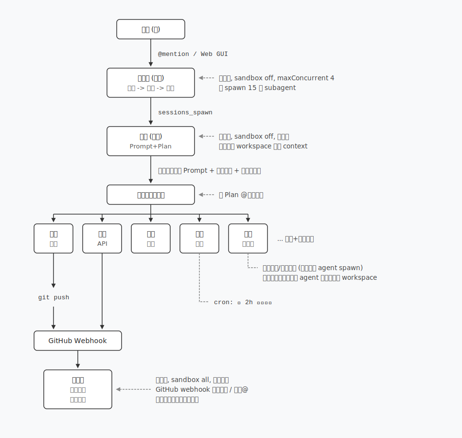
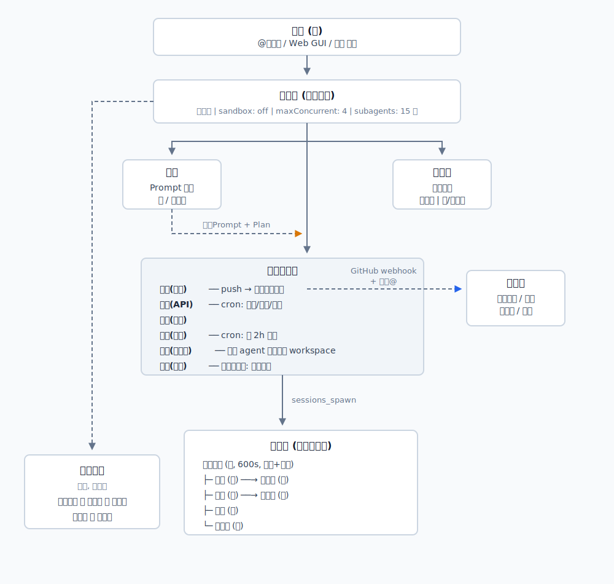
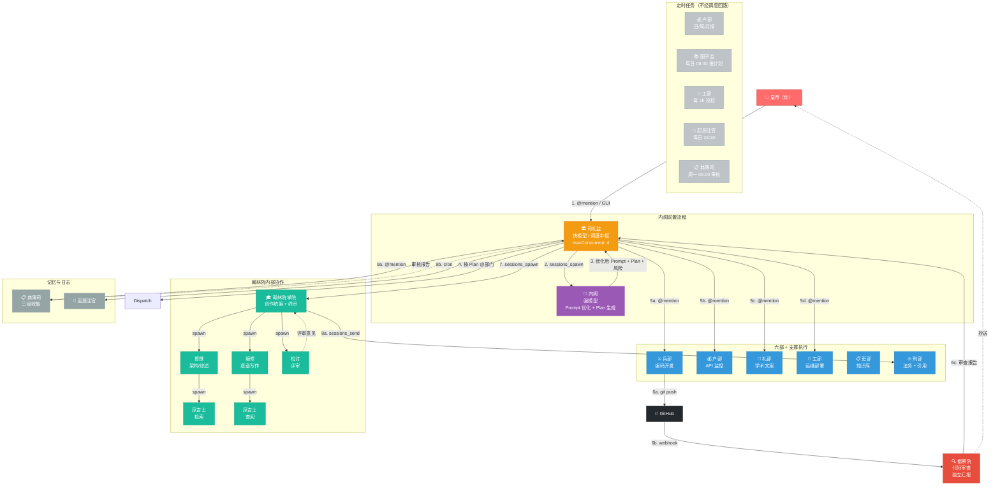

# 📚 御书房 Yushufang

> 基于 [danghuangshang](https://github.com/wanikua/danghuangshang) 上游项目定制的个人学术开发者 AI 多 Agent 协作系统。
> 一台服务器 + OpenClaw = 一个 7×24 在线的私人学术工作室。

<p align="center">
  
  
  
  
  
</p>

<p align="center">
  <strong>以明朝内阁制为蓝本，面向研究生 / 个人学术 + 代码开发者优化的多 Agent 系统。</strong><br/>
  代码开发 · 创作流水线 · API 监控 · 记忆管理 · 学习规划 · 生活辅助 —— 一台服务器全搞定。
</p>

---

## 项目定位

御书房是 [danghuangshang](https://github.com/wanikua/danghuangshang)（三省六部 × OpenClaw）的**个人学术开发者定制版**，针对**研究生 / 个人学术 + 代码开发者**的双重角色做了全面改造：

- **20 个 Agent**，每个 Agent 有独立的 Discord Bot、workspace、Persona
- **多 LLM Provider**：Anthropic / OpenAI / DeepSeek，每个 Agent 可独立指定模型
- **内阁前置**：非平凡任务必须先经内阁优化 Prompt 和生成执行计划，再由司礼监派发
- **创作流水线**：翰林院 5 角色协作（掌院 → 修撰/编修 → 检讨 → 庶吉士），支持论文和小说
- **自动化运维**：户部日/周/月报 + 典簿司记忆管理 + 工部健康巡检 + 起居注日志 + 国子监计划推送

快速开始：

```bash
git clone https://github.com/1012Lonin/Yushufang.git
cd Yushufang
bash scripts/full-install.sh
```

## 目录

- [朝廷架构](#朝廷架构) — 20 个 Agent 职责与组织架构
- [组织架构图](#组织架构图) — ASCII 图 + Mermaid
- [调度回路](#调度回路) — 从下旨到归档的完整流程
- [场景详解](#场景详解) — 开发 / 创作 / 文案 三种场景的完整链路
- [翰林院内部流水线](#翰林院内部流水线) — 创作调度的 5 级协作
- [自动化任务](#自动化任务) — 7 项 Cron 任务详解
- [三级记忆收集](#三级记忆收集) — 典簿司的三级机制
- [通信架构](#通信架构) — Discord / Web GUI 两路通信
- [模型配置指南](#模型配置指南) — Provider 配置与切换
- [费用优化建议](#费用优化建议)
- [部署方案](#部署方案)
- [项目结构](#项目结构)
- [与上游差异](#与上游-danghuangshang-的差异)

---

## 朝廷架构

### 核心调度链路

```
                    ┌──────────┐
                    │ 皇帝（你）│
                    └────┬─────┘
                         │ @mention / Web GUI
                         ▼
               ┌─────────────────┐
               │  司礼监（调度）  │ ◄── 快模型, sandbox off, maxConcurrent 4
               │  接旨→内阁→派发  │     可 spawn 15 个 subagent
               └────────┬────────┘
                        │ sessions_spawn
                        ▼
               ┌─────────────────┐
               │  内阁（优化）    │ ◄── 强模型, sandbox off, 无子代
               │  Prompt+Plan    │     读取吏部 workspace 补充 context
               └────────┬────────┘
                        │ 返回【优化后 Prompt + 执行计划 + 风险提示】
                        ▼
               ┌─────────────────┐
               │  司礼监决策派发  │ ◄── 按 Plan @对应部门
               └───┬──┬──┬──┬───┘
       ┌───────┬───┘  │  │  │
       ▼       ▼      ▼  ▼  ▼
    ┌────┐ ┌────┐ ┌────┐┌────┐┌────┐
    │兵部│ │户部│ │礼部││工部││吏部││ ... 六部+支撑部门
    │开发│ │API │ │文案││运维│ │知识库│
    └─┬──┘ └─┬──┘ └─┬──┘└─┬──┘└─┬──┘
      │       │       │      │     │
      │       │       │      │     └── 项目注册/进度更新（不被其他 agent spawn）
      │       │       │      │          知识读取路径：其他 agent 直接读取其 workspace
      ▼       │       │      │
   git push   │       │      │
      │       │       │      └── cron: 每 2h 健康巡检
      ▼       │       │
 ┌────────────┘       │
 │ GitHub Webhook     │
 └─────┬──────────────┘
       ▼
 ┌──────────┐
 │ 都察院    │ ◄── 强模型, sandbox all, 独立审查
 │ 代码审查  │     GitHub webhook 自动触发 / 手动@
 │ 独立汇报  │     直接向皇帝和司礼监汇报
 └──────────┘
```



### 部门一览表

| Agent | 模型 | 沙箱 | 核心职责 | 触发方式 |
|---|---|---|---|---|
| **司礼监** | 快模型 | off | 调度枢纽，接收旨意 → 送内阁 → 按 Plan 派发 → 汇总结果 → @典簿司归档 | Discord @mention / Web GUI |
| **内阁** | 强模型 | off | 分析需求完整性 → 输出【优化后 Prompt + 执行计划 + 风险提示】→ 重大决策审议/否决权 | `sessions_spawn`（司礼监调用） |
| **兵部** | 强模型 | all | 编码开发、git push，完成后在 `workspace/reports/` 写工作简报标注【需记忆】 | @mention |
| **户部** | 强模型 | off | API 用量监控 + 日/周/月报 + 异常消耗告警 | cron 定时 / @mention / 阈值触发 |
| **礼部** | 快模型 | off | 学术文案、邮件模板、社交媒体内容创作 | @mention |
| **工部** | 快模型 | off | 运维部署、服务器配置、健康巡检（每 2h 检查磁盘/内存/Docker） | @mention / cron |
| **吏部** | 快模型 | off | 知识库维护、项目注册/注销、进度更新 | @mention（不被其他 agent spawn调用，知识通过直接读取 workspace 获取） |
| **刑部** | 快模型 | off | 引用审计、法务合规、合同审查、知识产权 | @mention / `sessions_send`（翰林院调用） |
| **翰林院·掌院学士** | 强模型 | all | 创作统筹，调度修撰/编修/检讨/庶吉士，拥有终审权 | `sessions_spawn` |
| **翰林院·修撰** | 强模型 | all | 架构设计：大纲、世界观、人物档案、文献综述 | `sessions_spawn`（掌院调用） |
| **翰林院·编修** | 强模型 | all | 逐章执笔写作，每章≥10000 字，分段写作+归档 | `sessions_spawn`（掌院调用） |
| **翰林院·检讨** | 快模型 | all | 同行评审：文笔/逻辑/情节/一致性/节奏，三级问题标注 | `sessions_spawn`（掌院调用） |
| **翰林院·庶吉士** | 快模型 | all | 纯信息检索：搜索前文、查阅资料、检索外部信息，不改文件 | `sessions_spawn`（掌院/修撰/编修调用） |
| **都察院** | 强模型 | all | 代码审查（push 自动触发）、质量审计、安全评估，直接汇报皇帝 | GitHub webhook / @mention |
| **典簿司** | 快模型 | off | 记忆录入/审核/修正，三级收集机制，周度交叉比对 | @mention / cron / 被动修正 |
| **起居注官** | 快模型 | off | 每日自动生成起居注，按【诏令】【奏报】【审议】【异常】四类归档 | cron（23:30 每日） |
| **国子监** | 快模型 | off | 教育培训、学习计划制定与多计划管理、每日计划推送（8:00 cron） | @mention / cron |
| **太医院** | 快模型 | off | 健康管理、饮食营养、训练计划 | @mention |
| **内务府** | 快模型 | off | 日程安排、个人事务后勤、日常起居 | @mention |
| **御膳房** | 快模型 | off | 膳食管理、美食推荐、食谱研究 | @mention |

> 完整配置见 `configs/ming-neige/openclaw.json`（20 个 agent 定义、20 个 Discord account、20 个 binding、7 个 cron）。

---

## 组织架构图

### ASCII 架构图

```
┌───────────────────────────────────────────────────────────────────────────┐
│                              皇帝（你）                                    │
│                    @司礼监 / Web GUI / 飞书 下旨                           │
└────────────────────────────────────┬──────────────────────────────────────┘
                                     ▼
                  ┌─────────────────────────────────────┐
                  │          司礼监（调度中枢）            │
                  │  快模型 │ sandbox: off │ maxConcurrent: 4 │
                  │         subagents: 15 个              │
                  └──────────────────┬──────────────────┘
                                     │
                  ┌──────────────────┼──────────────────┐
                  │                  │                  │
                  ▼                  ▼                  ▼
            ┌──────────┐      ┌──────────┐      ┌──────────┐
            │   内阁     │      │  都察院   │      │  典簿司   │
            │  Prompt   │      │ 代码审查  │      │ 记忆管理  │
            │  优化     │      │  独立    │      │  快模型   │
            │ 强/无子代 │      │ 强/独立  │      │ 无/无子代 │
            └────┬─────┘      └────┬─────┘      └──────────┘
                 │ 返回Prompt│       │
                 │ +Plan    │ GitHub webhook
                 │          │ + 手动@
                 │          ▼
                 │    ┌──────────────┐
                 │    │   六部执行层   │
                 │    │              │
                 │    │ 兵部(开发)───┼── push → 自动触发审查
                 │    │ 户部(API)    │    cron: 日报/周报/月报
                 │    │ 礼部(文案)   │
                 │    │ 工部(运维)   │    cron: 每 2h 巡检
                 │    │ 吏部(知识库) │    其他 agent 直接读其 workspace
                 │    │ 刑部(法务)───┘    翰林院调用: 引用审计
                 │    └───────┬────────┘
                 │            │ sessions_spawn
                 │            ▼
                 │  ┌─────────────────────────────────┐
                 │  │         翰林院（创作流水线）       │
                 │  │                                   │
                 │  │  掌院学士(强,600s,统筹+终审)       │
                 │  │  ├─ 修撰(强) ──→ 庶吉士(快)       │
                 │  │  ├─ 编修(强) ──→ 庶吉士(快)       │
                 │  │  ├─ 检讨(快)                     │
                 │  │  └─ 庶吉士(快)                   │
                 │  └─────────────────────────────────┘
                 │
    ┌────────────┴───────────────┐
    │    生活辅助（可选，快模型）    │
    │  起居注官   国子监   太医院  │
    │  内务府     御膳房          │
    └────────────────────────────┘
```



### Mermaid 完整调度图



---

## 调度回路

### 总调度回路——从下旨到归档

下面描述一次**非平凡任务**（即需要内阁前置的任务）的完整流转链路，包含每个环节使用的通信方式和工具调用。

```
步骤 1: 皇帝下旨
  你 @司礼监 "给 myapi 项目写一个用户注册 API"
  通信: Discord @mention → 司礼监 Bot 收到消息

步骤 2: 司礼监送内阁
  司礼监 执行 sessions_spawn(agentId: neige)
    传入: 用户原始需求
    返回: 内阁的优化结果
  通信: 内部 API 调用（不经过 Discord 频道）
  注意: 司礼监在此步骤等待内阁返回，不做其他操作

步骤 3: 内阁优化
  内阁 分析需求 → 判断完整性
  需求明确则输出三件套:
    【优化后 Prompt】兵部用 Node.js + PostgreSQL 实现 /api/register
      - 角色: 兵部尚书
      - 任务: 实现用户注册 API
      - 技术要求: bcrypt 加密, JWT token, 输入验证
      - 格式: 代码 + 测试 + 文档
    【执行计划】
      1. @兵部 实现注册 API 路由和中间件
      2. @吏部 更新 myapi 项目 STATUS.md
      3. @典簿司 记录 JWT/bcrypt 技术决策
    【风险提示】
      - Secret key 不能硬编码
      - 需要确认数据库表结构

步骤 4: 司礼监按 Plan 派发
  司礼监 在 Discord #兵部 频道:
    "@兵部 按内阁方案实现注册 API（附完整上下文）"
  司礼监 在 Discord #吏部 频道:
    "@吏部 更新 myapi STATUS.md"
  注意: 一切派发在频道内公开可见

步骤 5: 各部门并行执行
  兵部:
    - 读取吏部 workspace 获取 myapi 技术栈
    - 编写 authController.js, authMiddleware.js
    - 编写测试用例
    - git commit + push → 触发 GitHub webhook
    - 在 #兵部 汇报: "注册 API 已完成"

  吏部:
    - 读取 projects/myapi/STATUS.md
    - 更新进度: "JWT 认证模块 ✅"

步骤 6: 都察院自动审查
  GitHub webhook → 都察院收到 commit + diff
  都察院逐文件检查:
    - 安全: bcrypt.compare() ✅
    - 规范: 错误信息脱敏 ⚠️
  结论发布到 #都察院: "@司礼监 @兵部 审查报告..."

步骤 7: 兵部修复（如有问题）
  兵部修改后再次 push → 重新触发审查
  都察院 → "✅ 审查通过"

步骤 8: 记忆归档
  司礼监 @典簿司 "记录本次开发的技术决策"
  典簿司:
    - 读取 兵部 workspace/.auto-log/ (git hook 日志)
    - 读取 兵部 workspace/reports/ (工作简报)
    - 提取关键信息 → 格式化为 decision-template.md
    - 写入 兵部 memory/ 目录
    - 汇报: "已记录 2 条技术决策"

步骤 9: 汇报皇帝
  司礼监 @皇帝 "注册 API 开发、审查、归档全部完成 ✅"

步骤 10: 起居注记录（23:30 自动触发）
  起居注官 扫描今日各频道消息:
    生成【起居注 2026-04-06】
    【诏令】08:30 加注册 API
    【奏报】08:40 兵部完成, 08:44 审查通过
    【异常】无
```

### 跳过内阁的快捷路径

当任务属于**纯闲聊 / 简单问答 / 状态查询 / 紧急 hotfix**时：

```
皇帝 @司礼监 "今天 token 用了多少"
  → 司礼监直接 @户部 "查询今日 API 用量"
  → 户部读取 api-usage.json → 返回数据
  → 司礼监汇总后汇报皇帝
（跳过内阁，不经过步骤 2-3）
```

---

## 场景详解

### 场景 A：日常开发——从下旨到记忆归档

详细流程见上方「调度回路」章节。核心路径：

```
你 → 司礼监 → 内阁(Prompt优化) → 司礼监派发 → 兵部(开发) → GitHub push
  → 都察院(webhook审查) → 吏部(更新进度) → 典簿司(记忆归档) → 汇报你
```

### 场景 B：创作任务——翰林院流水线

```
① 你: "@司礼监 写一篇关于 Transformer 在医疗影像中应用的论文"

② 司礼监 → 内阁: sessions_spawn("优化论文需求")
   内阁返回:
     【执行计划】翰林院掌院统筹 → 修撰(综述) → 编修(写作) → 检讨(评审) → 刑部(引用审计)
   司礼监 → 翰林院掌院: sessions_spawn("开始创作")

③ 翰林院掌院内部调度:
   3a. spawn 修撰: "做多模态医学影像分割文献综述"
       修撰 → spawn 庶吉士: "检索最新论文"
       庶吉士返回 15 篇论文摘要
       修撰完成【文献综述 + 章节规划】→ 上报

   3b. spawn 编修: "写'方法'章节"
       编修 → spawn 庶吉士: "查阅前文确保一致性"
       编修完成章节初稿 → 上报

   3c. spawn 检讨: "评审方法章节"
       检讨三级标注: 🔴缺消融实验 🟡3处引用不规范
       上报掌院

   3d. 掌院 → 编修修改 → 检讨二审 ✅

④ 掌院 → 刑部: sessions_send("引用审计")
   刑部: 12篇引用，3处格式不规范 → 返回
   掌院修正 → 终审通过

⑤ 掌院 → 司礼监: "论文定稿"

⑥ 司礼监 → 典簿司: "记录方法论决策"
   典簿司 → 写入 memory/

⑦ 司礼监 → 你: "论文完成 ✅"
```

### 场景 C：学术邮件

```
你: "@司礼监 帮我想一下怎么给导师写邮件，请教实验方案的对照组设计"
  → 司礼监判断为简单任务，跳过内阁
  → 直接 @礼部: "起草一封学术请教邮件"

礼部:
  老师您好，
  我是 XXX，最近在推进实验设计，
  在对比实验的对照组选择上...
  期待您的指导！

  发送建议: 工作日上午发送，可附上一页实验设计草稿
  → 直接发送给你
```

---

## 翰林院内部流水线

翰林院是一个**可内部 spawn 子 agent 的协作子系统**，掌院学士拥有最高调度权和终审权。

### 内部拓扑

```
              掌院学士 (强模型, 600s, sandbox all)
              统筹 + 终审
              subagents: 修撰, 编修, 检讨, 庶吉士
                    │
        ┌───────────┼───────────┐
        ▼           ▼           ▼
     修撰(强)     编修(强)    检讨(快)
     架构/综述    逐章写作    同行评审
        │           │           │
        ▼           ▼
     庶吉士(快)   庶吉士(快)
     文献检索     文献查阅
```

### 调用权限

| 角色 | subagents | 说明 |
|---|---|---|
| 掌院学士 | 修撰, 编修, 检讨, 庶吉士, 起居注官 | 统筹调度，600s 超时 |
| 修撰 | 庶吉士, 起居注官 | 可 spawn 庶吉士检索文献 |
| 编修 | 庶吉士, 起居注官 | 可 spawn 庶吉士查阅前文 |
| 检讨 | 无 | 只评审，不 spawn 子 agent |
| 庶吉士 | 无 | 纯检索，不改文件，不 spawn |

### 创作流程详解

1. **掌院接单**：收司礼监 `sessions_spawn` 任务，拆解需求
2. **修撰阶段**：spawn 修撰做文献综述/架构设计 → 修撰 spawn 庶吉士检索 → 返回综述
3. **编修阶段**：spawn 编修逐章写作 → 编修 spawn 庶吉士查阅前文确保一致性 → 返回初稿
4. **检讨阶段**：spawn 评审 → 三级标注（🔴致命/🟡重要/🟢优化）→ 上报
5. **刑部审计**：掌院 `sessions_send` 刑部做引用审计 → 返回审计报告
6. **终审定稿**：掌院综合评审 + 审计结果终审 → 返回司礼监

---

## 自动化任务

### 7 项 Cron 任务详解

| ID | 频率 | Agent | 触发 | LLM 调用 | 详情 |
|---|---|---|---|---|---|
| `hubu-daily-report` | 每日 23:00 | 户部 | cron | ✅ | 读取 `workspace/data/api-usage.json`，生成日报：今日消耗、本月累计、部门排行、异常波动、优化建议 |
| `hubu-weekly-report` | 周一 09:00 | 户部 | cron | ✅ | 读取过去 7 天数据，生成周报：趋势(↑/↓/→)、日均、月底预测、优化建议、成本排名 |
| `hubu-monthly-report` | 月末 23:59 | 户部 | cron | ✅ | 读取全月数据，生成月报：总消耗、预算执行率、部门占比、最贵日期、下月预算建议（非月末自动跳过） |
| `dianbosi-weekly-audit` | 周一 09:00 | 典簿司 | cron | ✅ | 遍历所有 agent `memory/` 目录，交叉比对一致性，检查过期条目(>30天)，生成审核报告汇报司礼监 |
| `qijuzhu-daily-log` | 每日 23:30 | 起居注官 | cron | ✅ | 扫描今天各频道工作消息，生成【起居注 YYYY-MM-DD】，按【诏令】【奏报】【审议】【异常】四类归档 |
| `gongbu-health-check` | 每 2 小时 | 工部 | cron | ✅ | 检查磁盘空间、内存使用、Docker 容器状态，异常汇报司礼监，正常只记日志 |
| `guozijian-daily-plan` | 每日 08:00 | 国子监 | cron | ✅ | 扫描 `workspace/plans/` 下活跃学习计划，根据各自周期规划生成今日学习内容，汇总给皇帝 |

### 户部数据管道（v1.1.0 重构）

户部采用 **Python 脚本（零 LLM）+ Agent 报告（固定 LLM）** 混合架构：

```
每 30 分钟: Python 脚本（hubu_data_collect.py，零 LLM 调用）
  ↓ curl GUI API 获取 totalTokens
  ↓ 读各 agent sessions.json 推算部门用量
  ↓ 写入 ticks/YYYY-MM-DD.jsonl（时间序列）
  ↓ 阈值检查（见下表）：
     Soft → 只记日志
     Hard → 发 Discord @司礼监
     月额 90% → @司礼监 + @皇帝

阈值表（月限额 5,000,000）：
  5h滚动窗口  Soft: 80,000  Hard: 120,000
  日用量      Soft: 120,000  Hard: 166,667
  周配额      Soft: 800,000   Hard: 1,000,000
  月配额      Soft: 3,500,000 (70%)  Hard: 4,500,000 (90%)
  告警冷却: 4 小时内同类不重复

每日 23:00: 户部 Agent 日报
  ↓ 读 daily-snapshots/YYYY-MM-DD.json
  ↓ 生成结构化日报（含 5h 窗口状态）

每周一 09:00: 户部 Agent 周报
  ↓ 读 weekly-snapshots/YYYY-WXX.json + 过去 7 天每日快照
  ↓ 趋势分析 + 预测 + 建议

月末 23:00: 户部 Agent 月报
  ↓ 读当月所有每日快照
  ↓ 决算 + 下月预算建议
```

阈值支持三种自定义方式（优先级从高到低）：
1. 环境变量：`HUBU_ROLLING_SOFT`、`HUBU_WEEKLY_HARD` 等
2. `thresholds.json`：`~/.clawd-hubu/data/thresholds.json`
3. Python 代码硬编码默认值

> 脚本路径由 `hubu-data-collect.sh` 提供，配合系统 crontab `*/30 * * * *` 运行，完全不经过 LLM。

---

## 三级记忆收集

典簿司只能读取各 agent 的 workspace 和 memory 目录，采用三级收集机制：

### 第一级：Agent 工作简报（主动写入）

每个 agent 完成任务后，在 `workspace/reports/` 写一份简短 `.md`：
```
- 做了什么
- 关键技术决策
- 遇到的问题和解决方案
- 【需记忆】标记高价值经验 ← 典簿司重点关注
```

### 第二级：Git 变更自动捕获（零成本）

兵部等项目开发 agent 配置 Git post-commit hook：
```bash
#!/bin/bash
# 写入 workspace/.auto-log/YYYY-MM-DD.md
# 内容: commit message + 变更文件列表
```
典簿司读取 `.auto-log/` 了解代码变更，提取技术决策。

### 第三级：司礼监触发典簿司扫描（兜底）

当司礼监发现某个 agent 完成了工作但没有写简报或 git 日志时：
```
司礼监 → @典簿司 "读取兵部最近 24 小时的所有变更"
典簿司:
  1. 读 reports/
  2. 读 .auto-log/
  3. 运行 git log --oneline --since "24 hours ago"
  4. 综合 → 格式化 → 写入 memory/
```

典簿司输出产物为标准化模板文件（`decision-template.md`、`bug-template.md` 等），存放在对应 agent 的 `memory/` 目录下。

---

## 通信架构

御书房支持两路通信，通过 OpenClaw Gateway（端口 18789）统一调度：

```
┌──────────────────────────────────────────────────┐
│                   OpenClaw Gateway               │
│                   Port: 18789                    │
│                                                  │
│  Discord (20 Bot)               Web GUI          │
│  allowBots:mentions            Port: 18795       │
│       │                              │          │
│       └──────────────────────────────┘          │
│                          ▼                       │
│              ┌─────────────────────┐             │
│              │  消息路由 / Binding  │             │
│              │  @Bot → 对应 Agent   │             │
│              └─────────────────────┘             │
└──────────────────────────────────────────────────┘
```

- **Discord**：20 个 Bot 分别对应 20 个 agent，通过 `@mention` 路由，`allowBots: "mentions"` 防止 Bot 互触发
- **Web GUI**：React + Vite 前端（端口 18795）+ Express 后端，提供朝堂总览 + 会话管理

> **跨频道通信说明**：Discord `@mention` **只在同频道内有效**——司礼监 `@兵部` 需要两者都在同一频道。推荐将所有 agent 加入共享工作频道，派发结果也发到这里。跨频道场景使用 `sessions_spawn` / `sessions_send`，这是 OpenClaw 内部机制，**不受频道限制**，无需共享频道也能通信。

---

## 模型配置指南

### 当前 Provider 配置

项目已预置三个 LLM Provider 架构，均在 `configs/ming-neige/openclaw.json` 的 `models.providers` 中：

| Provider | 用途建议 | 预置模型 |
|---|---|---|
| `anthropic` | 强推理（内阁/兵部/吏部/翰林院/都察院） | claude-sonnet-4-6, claude-haiku-4-5 |
| `openai` | 轻量任务（司礼监/工部/刑部） | gpt-4o-mini, gpt-4o |
| `deepseek` | 低成本任务（户部/礼部/典簿司/起居注官） | deepseek-chat |

### 如何更换模型 / 添加新 Provider

**1. 添加新 Provider（如 Google Gemini）**

在 `configs/ming-neige/openclaw.json` 的 `models.providers` 中添加：

```json
{
  "google": {
    "baseUrl": "https://generativelanguage.googleapis.com/v1beta/openai",
    "apiKey": "YOUR_GOOGLE_API_KEY",
    "api": "openai-completions",
    "models": [
      { "id": "gemini-2.0-flash", "name": "Gemini 2.0 Flash", "input": ["text"], "contextWindow": 1000000, "maxTokens": 8192 }
    ]
  }
}
```

`api` 字段值取决于 API 协议类型：
- OpenAI 兼容 API：`"openai-completions"`
- Anthropic Messages API：`"anthropic-messages"`

**2. 修改 Agent 使用的模型**

在 `agents.list` 中找到对应的 agent，修改 `model.primary` 字段：

```json
{
  "id": "silijian",
  "name": "司礼监",
  "model": {
    "primary": "openai/gpt-4o-mini"
  },
  ...
}
```

格式：`"provider名/模型id"`，其中 `provider名` 必须与 `models.providers` 中的 key 一致。

**3. 添加新模型到已有 Provider**

在对应 Provider 的 `models` 数组中添加新条目：

```json
"models": [
  { "id": "claude-sonnet-4-6", "name": "Claude Sonnet 4.6", "input": ["text", "image"], "contextWindow": 200000, "maxTokens": 32768 },
  { "id": "claude-opus-4-6", "name": "Claude Opus 4.6", "input": ["text", "image"], "contextWindow": 200000, "maxTokens": 32768 }
]
```

**4. 切换现有 Agent 到省钱模型**

例如把内阁从 Sonnet 切换到 GPT-4o：

```json
{
  "id": "neige",
  "model": { "primary": "openai/gpt-4o" }
}
```

### 费用优化建议

| 场景 | 推荐模型 | 原因 |
|---|---|---|
| 司礼监（纯调度） | gpt-4o-mini / deepseek-chat | 简单路由判断 |
| 内阁/兵部/都察院 | claude-sonnet-4-6 | 强推理+代码能力 |
| 学术文案 | deepseek-chat | 便宜且速度快 |
| 论文写作 | claude-sonnet-4-6 | 深度推理+长文本 |
| 日常辅助 | gpt-4o-mini | 成本低 |

### 完整 Agent-模型映射表（默认）

> 实际代码中，当前模型配置使用占位符，以下为推荐映射：

| Agent | 默认模型 | 如何改 |
|---|---|---|
| 司礼监 | `your-provider/fast-model` | 编辑 `openclaw.json` → `silijian.model.primary` |
| 内阁 | `your-provider/strong-model` | 编辑 `openclaw.json` → `neige.model.primary` |
| 兵部 | `your-provider/strong-model` | 编辑 `openclaw.json` → `bingbu.model.primary` |
| 户部 | `your-provider/strong-model` | 编辑 `openclaw.json` → `hubu.model.primary` |
| 礼部 | `your-provider/fast-model` | 编辑 `openclaw.json` → `libu.model.primary` |
| 工部 | `your-provider/fast-model` | 编辑 `openclaw.json` → `gongbu.model.primary` |
| 吏部 | `your-provider/fast-model` | 编辑 `openclaw.json` → `libu2.model.primary` |
| 刑部 | `your-provider/fast-model` | 编辑 `openclaw.json` → `xingbu.model.primary` |
| 掌院学士 | `your-provider/strong-model` | 编辑 `openclaw.json` → `hanlin_zhang.model.primary` |
| 修撰 | `your-provider/strong-model` | 编辑 `openclaw.json` → `hanlin_xiuzhuan.model.primary` |
| 编修 | `your-provider/strong-model` | 编辑 `openclaw.json` → `hanlin_bianxiu.model.primary` |
| 检讨 | `your-provider/fast-model` | 编辑 `openclaw.json` → `hanlin_jiantao.model.primary` |
| 庶吉士 | `your-provider/fast-model` | 编辑 `openclaw.json` → `hanlin_shujishi.model.primary` |
| 典簿司 | `your-provider/fast-model` | 编辑 `openclaw.json` → `dianbosi.model.primary` |
| 起居注官 | `your-provider/fast-model` | 编辑 `openclaw.json` → `qijuzhu.model.primary` |
| 国子监 | `your-provider/fast-model` | 编辑 `openclaw.json` → `guozijian.model.primary` |
| 太医院 | `your-provider/fast-model` | 编辑 `openclaw.json` → `taiyiyuan.model.primary` |
| 内务府 | `your-provider/fast-model` | 编辑 `openclaw.json` → `neiwufu.model.primary` |
| 御膳房 | `your-provider/fast-model` | 编辑 `openclaw.json` → `yushanfang.model.primary` |
| 都察院 | `your-provider/strong-model` | 编辑 `openclaw.json` → `duchayuan.model.primary` |

> 所有 Agent 的 `model.primary` 字段使用占位符 `your-provider/fast-model` 或 `your-provider/strong-model`，安装后可自由替换。

---

## 部署方案

### Docker Compose

```bash
# 1. 复制配置
cp configs/ming-neige/openclaw.json ~/.openclaw/openclaw.json
# 2. 编辑 openclaw.json 填入 API Keys + Discord Bot Tokens
# 3. 启动
docker compose up -d
```

### 非 Docker 本地部署

```bash
npm install -g openclaw
git clone https://github.com/1012Lonin/Yushufang.git
cd Yushufang
cp configs/ming-neige/openclaw.json ~/.openclaw/openclaw.json
# 编辑配置文件
openclaw gateway start
```

### 个人配置仓库推荐结构

```
my-ai-court/
├── config/openclaw.json     ← 从 configs/ming-neige/ 复制后修改
├── docker-compose.yml
├── .env.example
├── scripts/hubu-data-collect.sh
├── scripts/git-hook-post-commit
└── README.md
```

### Discord 频道设置

推荐创建以下 Discord 频道用于公开工作流转：

| 频道名 | 用途 |
|---|---|
| `#上书房` | 皇帝与司礼监的主频道 |
| `#内阁` | 内阁分析需求（可 private） |
| `#兵部` | 代码开发讨论 |
| `#工部` | 运维部署 |
| `#礼部` | 文案和内容创作 |
| `#翰林院` | 论文/小说创作 |
| `#都察院` | 代码审查结果 |
| `#起居注` | 起居注官日志 |

> 安全配置：确保 `"allowBots": "mentions"`，防止 Bot 相互触发导致消息风暴。

---

## 项目结构

```
Yushufang/
├── configs/
│   ├── ming-neige/              # 明朝内阁制（本项目核心配置）
│   │   ├── openclaw.json        # 完整配置：20 Agent + 7 Cron + 20 Binding
│   │   ├── SOUL.md              # 明朝内阁制行为准则
│   │   └── agents/              # 20 个 Agent 角色人设
│   │       ├── silijian.md      # 调度枢纽（5 件事，禁直接执行）
│   │       ├── neige.md         # 三件套输出 + 吏部 workspace 读取
│   │       ├── bingbu.md        # 开发 + 工作简报
│   │       ├── hubu.md          # 日/周/月报模板
│   │       ├── libu.md          # 学术文案
│   │       ├── gongbu.md        # 运维 + 健康巡检
│   │       ├── libu2.md         # 知识库中枢
│   │       ├── xingbu.md        # 法务 + 引用审计
│   │       ├── duchayuan.md     # 代码审查（独立）
│   │       ├── hanlin_*.md      # 翰林院 5 角色
│   │       ├── dianbosi.md      # 记忆管理（三级收集）
│   │       ├── qijuzhu.md       # 起居注（四类归档）
│   │       ├── guozijian.md     # 学习规划（多计划管理）
│   │       ├── taiyiyuan.md     # 健康
│   │       ├── neiwufu.md       # 后勤
│   │       └── yushanfang.md    # 膳食
│   ├── tang-sansheng/           # 唐朝三省制（上游保留）
│   ├── modern-ceo/              # 现代企业制（上游保留）
│   └── feishu*/                 # 飞书适配配置（上游保留）
├── scripts/
│   ├── full-install.sh          # 一键完整安装
│   ├── hubu-data-collect.sh     # 户部数据收集（零 LLM）
│   └── ...                      # 安装/诊断/备份脚本
├── docs/                        # 60+ 文档（安装、排障、部署、安全）
├── docker/                      # Docker 入口/初始化脚本
├── Dockerfile
├── docker-compose.yml
├── CLAUDE.md
└── .env.example
```

---

## 与上游 danghuangshang 的差异

| 差异项 | danghuangshang（上游） | Yushufang（本项目） |
|---|---|---|
| 定位 | 通用多 Agent 系统，支持多种制度 | 聚焦**明朝内阁制**，面向学术开发者 |
| Agent 数量 | 18+ | **20 个**，增加国子监/太医院/内务府/御膳房 |
| 模型配置 | 占位符 | 预置 3 Provider + 推荐模型策略 |
| 户部 | 基础监控 | **Python 重构**：5h 滚动窗口 + 周配额 + 月配额，软/硬阈值可自定义 |
| 记忆管理 | 基础 | 三级收集 + 周度审核 |
| 翰林院 | 5 Agent 小说创作 | 5 Agent 创作流水线（论文/小说均可） |
| 国子监 | 基础学习 | 多计划管理 + 每日 08:00 cron 推送 |
| 司礼监 | 基础调度 | task-store 状态机跟踪 + 内阁前置严格化 |
| Cron 任务 | 6 项 | **7 项**（新增国子监每日计划推送） |

---

## 更新日志

[CHANGELOG.md](./CHANGELOG.md)

---

## 许可证

[MIT License](LICENSE). 基于 [danghuangshang](https://github.com/wanikua/danghuangshang) 项目二次开发，欢迎 Fork / PR。使用时请注明出处。
