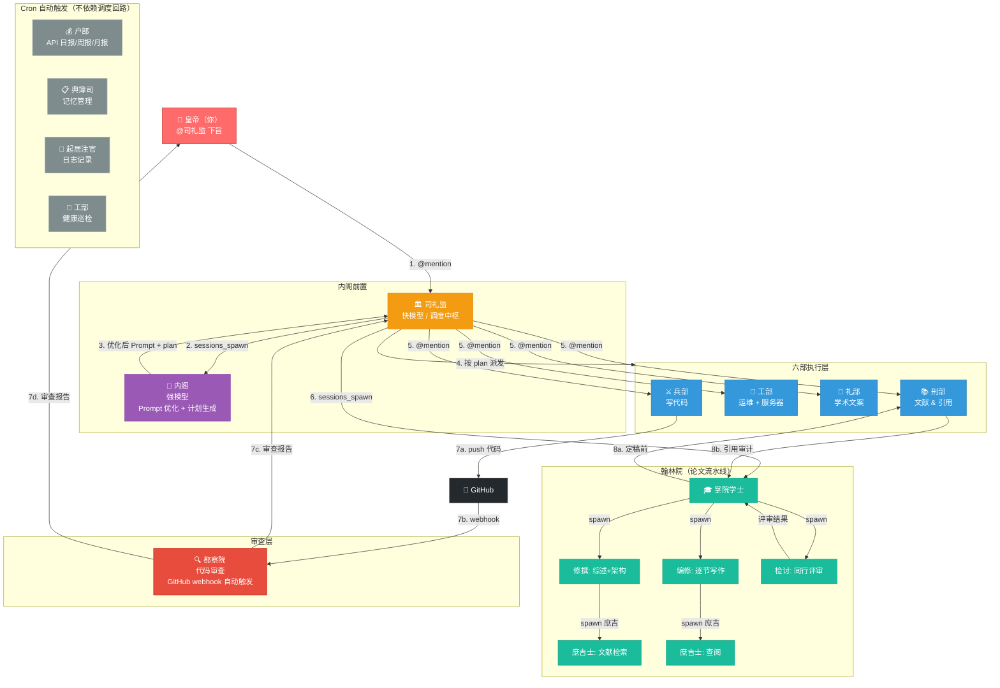

# 当皇上 · 个人学术开发者改造方案 v4

> 针对个人学术+代码开发者的角色定位，精简冗余部门，强化核心能力。
> 版本：v4 | 日期：2026-04-05

---

## 一、改造后完整调用拓扑

```
┌─────────────────────────────────────────────────────────────────┐
│                        皇帝（你）                                 │
│               @司礼监 / Web GUI 下旨                              │
└──────────────────────────┬──────────────────────────────────────┘
                           ▼
              ┌────────────────────────┐
              │  司礼监                │  快模型, sandbox: off
              │  接旨 → 内阁前置 → 派发 │  subagents: 11个
              │  maxConcurrent: 4      │  最高调度权
              └────────┬───────────────┘
                       │
          ┌────────────┼─────────────┼──────────────────┐
          ▼            ▼             ▼                  ▼
   ┌──────────┐  ┌───────────┐  ┌──────────┐     ┌──────────┐
   │  内阁     │  │  吏部      │  │  户部     │     │  典簿司   │
   │ Prompt优化│  │ 知识底座   │  │ API监控   │     │ 记忆管理  │
   │ 强模型    │  │ 强模型     │  │ 快模型    │     │ 快模型    │
   │ ❌无子代  │  │ ❌无子代   │  │ ❌无子代  │     │ ❌无子代  │
   └────┬─────┘  └─────┬─────┘  └─────────┘     └─────────┘
        │ sessions_spawn
        ▼
┌──────────────────────────────────────────────────────────────┐
│  六部执行层（按内阁 plan 派发）                                 │
│                                                              │
│  兵部(开发)   工部(运维+服务器)  礼部(文案)    刑部(文献)       │
│  强模型, 沙箱  快模型           快模型       快模型           │
│  ❌无子代     ❌无子代           ❌无子代     ❌无子代         │
└──────┬──────────────────┬─────────────────────┬──────────────┘
       │                  │                     │
       ▼                  ▼      sessions_send  ▼
┌──────────────┐  ┌──────────────┐ ┌────────────────────┐
│  翰林院(论文) │  │  都察院(审查) │ │ 刑部(引用审计→检讨)  │
│  院内部调度   │  │ 强模型        │ │                    │
│  流水线作业   │  │ sandbox: all  │ │ 论文定稿前送      │
└──────────────┘  │ GitHub webhook│ │                   │
                  │ ❌无子代      │ └────────────────────┘
                  └──────────────┘


翰林院内部拓扑：
  掌院学士(强, 600s)
    ├── 修撰(强) ──→ 庶吉士(快, 文献检索)
    ├── 编修(强) ──→ 庶吉士(快, 文献查阅)
    ├── 检讨(快)     ← 同行评审
    └── 庶吉士(快)   ← 纯信息检索

生活辅助（可选，快模型，无子代）：
  起居注官(日志)  国子监(学习)  太医院(健康)  内务府(后勤)  御膳房(膳食)

Cron 定时任务汇总（见第七节详细配置）：
  09:00 周一  → 典簿司周度记忆审核
  23:00 每日  → 户部 API 用量日报
  09:00 周一  → 户部周度分析（趋势+优化建议）
  23:00 月末  → 户部月度决算（全月汇总+下月预算建议）
  23:30 每日  → 起居注日志
  每 2 小时   → 工部健康巡检
  每 30 分钟  → 户部数据收集（Shell 脚本，零 LLM 调用）
```

---

## 二、完整调度回路

### 2.1 Mermaid 总览图



### 2.2 调度回路文字说明

| 步骤 | 流向 | 方式 | 说明 |
|---|---|---|---|
| 1 | 你 → 司礼监 | Discord @mention | 下达指令 |
| 2 | 司礼监 → 内阁 | `sessions_spawn` | 转发原始任务请求优化 |
| 3 | 内阁 → 司礼监 | spawn 返回值 | 返回优化后 Prompt + 执行计划 |
| 4 | 司礼监 决策 | 内部判断 | 按内阁 plan 决定派给谁 |
| 5 | 司礼监 → 六部 | Discord @mention | 在频道内公开派发任务 |
| 6 | 司礼监 → 翰林院 | `sessions_spawn` 给掌院 | 论文任务派给掌院统筹 |
| 7a | 兵部 → GitHub | Git push | 代码提交 |
| 7b | GitHub → 都察院 | Webhook 自动触发 | 代码审查 |
| 7c | 都察院 → 司礼监 | Discord @mention | 审查结果汇报 |
| 8 | 刑部 → 翰林院 | `sessions_send` | 引用审计报告反馈给掌院 |
| Cron | 引擎 → 对应 agent | cron 定时触发 | 户部/典簿司/起居注/工部巡检 |

---

## 三、完整调度链路详解

### 3.1 场景 A：日常开发任务——从下旨到记忆归档

```
① 皇帝: "@司礼监 给 myapi 项目写一个用户注册 API"
   ↓
② 司礼监 → 内阁: sessions_spawn("请优化这个需求的 Prompt")
   内阁 → 司礼监: 返回
     【优化后 Prompt】兵部用 Node.js + PostgreSQL 实现 /api/register
     【执行计划】1)兵部写代码 2)吏部更新项目进度 3)典簿司记录技术决策
   ↓
③ 司礼监 @兵部: 执行注册 API（附内阁优化后 prompt）
   ↓
④ 兵部: 写代码 → git push → 通知司礼监"注册 API 已完成"
   ↓
⑤ GitHub webhook → 都察院: 自动代码审查
   都察院 → @司礼监: "✅ 审查通过，代码规范良好"
   ↓
⑥ 司礼监 @吏部: "更新 myapi 项目 STATUS.md，注册 API 已完成"
   吏部: 写入 workspace/projects/myapi/STATUS.md
   ↓
⑦ 司礼监 @典簿司: "记录这次开发的关键信息到兵部 memory"
   典簿司:
     - 读取兵部 workspace/.auto-log/ 和 reports/ 目录
     - 提取: 技术决策（注册用 bcrypt 加密）、API 设计模式
     - 格式化为 decision-template.md
     - 存入 兵部的 memory/tech-decisions.md
     - 汇报: "已记录 2 条技术决策到兵部记忆"
   ↓
⑧ 司礼监 → @皇帝: "注册 API 开发、审查、归档全部完成 ✅"
```

### 3.2 场景 B：论文写作任务

```
① 皇帝: "@司礼监 写一篇关于 Transformer 在医疗影像中应用的论文"
   ↓
② 司礼监 → 内阁: sessions_spawn("优化论文需求")
   内阁 → 司礼监: 返回优化后 prompt + plan → 派给翰林院
   ↓
③ 司礼监 → 翰林院掌院: sessions_spawn("开始论文创作")
   ↓
④ 掌院学士 内部调度:
   - spawn 修撰: 做文献综述 → 修撰 spawn 庶吉士检索文献
   - 拿到综述后 → spawn 编修: 逐节写作
   - 编修完成后 → spawn 检讨: 同行评审
   ↓
⑤ 掌院学士 → 刑部: sessions_send("请对论文草稿进行引用审查")
   刑部 → 掌院: 返回引用审计报告
   ↓
⑥ 掌院学士: 终审，输出定稿 → 返回给司礼监
   ↓
⑦ 司礼监 @典簿司: "记录本次论文的方法论和关键结论"
   典簿司 → 写入 翰林院掌院的 memory/
   ↓
⑧ 司礼监 → @皇帝: "论文初稿已完成，请在 Discord 查看"
```

### 3.3 场景 C：典簿司记忆调度汇总

```
典簿司调用方式汇总
──────────────────────────────────────────────────

方式 1: 司礼监主动调度（每次任务完成后）
  司礼监 → @典簿司 "记录兵部本次开发的记忆"
    ↓
  典簿司:
    1. 读取兵部 workspace 最近的代码变更
       (.auto-log/ + reports/ + git log)
    2. 提取技术决策、架构变化、问题修复
    3. 格式化 → decision-template / bug-template
    4. 写入 兵部的 memory/
    5. 回报: "已记录 N 条记忆"

方式 2: Cron 周度审核（每周一 09:00 自动触发）
  Cron 引擎 → 典簿司
    ↓
  典簿司:
    1. 遍历所有 agent 的 memory/ 目录
    2. 交叉比对: 兵部 vs 工部的技术记录是否一致
    3. 检查过期条目（>30天的临时任务记忆）
    4. 生成【记忆审核报告】
    5. 汇报给司礼监

方式 3: 被动记忆修正（皇帝/司礼监发现错误记忆时）
  皇帝 → @典簿司 "兵部的记忆有误，数据库已是PG"
    ↓
  典簿司:
    1. 读取兵部 memory/ 找到冲突条目
    2. 修正: MySQL → PostgreSQL
    3. 记录修正日志
    4. 汇报: "已修正 1 条记忆"
```

---

## 四、各部门实现逻辑

### 4.1 司礼监（调度中枢）

| 属性 | 值 |
|---|---|
| 模型 | 快模型 |
| sandbox | off |
| subagents | 内阁, 都察院, 兵部, 户部, 礼部, 工部, 吏部, 刑部, 掌院学士, 起居注官, 典簿司 |
| maxConcurrent | 4 |
| 触发方式 | Discord @mention / Web GUI |

**核心职责**：
- 接收皇帝指令，**非 trivial 任务必须走内阁前置**
- 根据内阁 plan 中的部门指派，在 Discord 频道内 `@mention` 对应部门
- 汇总执行结果，反馈给皇帝
- 跳过内阁的情况：纯闲聊、简单问答、状态查询、紧急 hotfix

### 4.2 内阁（Prompt 优化）

| 属性 | 值 |
|---|---|
| 模型 | 强模型 |
| sandbox | off |
| subagents | 无 |
| 触发方式 | `sessions_spawn`（由司礼监调用） |

**核心职责**：
- 分析需求是否完整清晰，缺失则列出追问问题
- 输出三件套：**优化后 Prompt**（结构化）、**执行计划**（拆步标注部门）、**风险提示**
- 对重大决策（预算、架构变更、方向变更）行使否决权

### 4.3 六部 + 支撑部门

| 部门 | 模型 | sandbox | 触发方式 | 核心职责 |
|---|---|---|---|---|
| 兵部 | 强模型 | all (agent) | @mention | 编码开发，主动汇报结果 |
| 工部 | 快模型 | off | @mention / cron | 运维部署、服务器配置、自动巡检 |
| 礼部 | 快模型 | off | @mention | 学术文案、邮件模板、内容创作 |
| 吏部 | 强模型 | off | @mention | 知识库维护、项目注册、进度更新 |
| 刑部 | 快模型 | off | @mention / sessions_send | 引用审计、法务合规、合同审查 |
| 户部 | 快模型 | off | cron / 阈值触发 | API 用量监控 + 日/周/月报 |
| 典簿司 | 快模型 | off | @mention / cron | 记忆录入/审核/修正 |
| 都察院 | 强模型 | all (agent) | GitHub webhook / @mention | 代码审查、质量审计 |

### 4.4 翰林院（论文流水线）

| 角色 | 模型 | subagents | 权限说明 |
|---|---|---|---|
| 掌院学士 | 强模型 (600s) | 修撰, 编修, 检讨, 庶吉士 | 统筹调度 + 终审权 |
| 修撰 | 强模型 | 庶吉士 | 文献综述 + 架构设计 |
| 编修 | 强模型 | 庶吉士 | 逐节写作 + 归档 |
| 检讨 | 快模型 | 无 | 同行评审（三级问题标注） |
| 庶吉士 | 快模型 | 无 | 纯信息检索，不改文件 |

### 4.5 典簿司信息收集机制

典簿司只能读取各 agent 的 workspace 和 memory 目录。为解决 "agent 完成了工作但没有写入 workspace" 的问题，采用三级信息收集：

```
三级信息收集机制
────────────────────────────────────────

第一级：Agent 工作简报（主动写入 workspace）
  每个 agent persona 加入【工作简报要求】：
    "完成任务后，在 workspace/reports/ 写一份简短 .md：
     - 做了什么
     - 关键技术决策
     - 遇到的问题和解决方案
     - 【需记忆】标记高价值经验（典簿司重点关注此标记）"
    ↓
  典簿司读取 reports/ → 提取【需记忆】→ 写入 memory/

第二级：Git 变更自动捕获（零成本）
  Git post-commit hook 自动触发:
    写入 workspace/.auto-log/YYYY-MM-DD.md
    内容含 commit message + 变更文件列表
    ↓
  典簿司读取 .auto-log/ → 了解代码变更 → 提取技术决策

第三级：司礼监触发典簿司扫描（兜底）
  司礼监: "@典簿司 读取兵部最近 24 小时的所有变更"
    ↓
  典簿司:
    1. 读 reports/
    2. 读 .auto-log/
    3. 运行 git log --oneline --since "24 hours ago"
    4. 综合 → 格式化 → 写入 memory/
```

Git hook 脚本（放在每个 agent workspace 的 `.git/hooks/post-commit`）：

```bash
#!/bin/bash
DAY=$(date +%Y-%m-%d)
LOG_DIR="$HOME/clawd-bingbu/.auto-log"
mkdir -p "$LOG_DIR"
LAST_MSG=$(git log -1 --pretty=format:"%s")
FILES=$(git diff-tree --no-commit-id --name-only -r HEAD)
echo "## $LAST_MSG" >> "$LOG_DIR/$DAY.md"
echo "- Files: $FILES" >> "$LOG_DIR/$DAY.md"
echo "" >> "$LOG_DIR/$DAY.md"
```

---

## 五、户部数据管道（Shell 脚本 + 日/周/月报）

### 5.1 整体架构

```
每 30 分钟: Shell 脚本（零 LLM 调用）
  ↓ curl /api/tokens → 解析 → 写入 api-usage.json
  ↓ 检查阈值:
     - < 50% → 无操作，只记日志
     - ≥ 50% → 标记，等日报触发时户部 agent 分析
     - ≥ 80% → 立即告警（调用 openclaw message 发 Discord）

每 日 23:00: 户部 agent 日报（固定 LLM 调用）
  ↓ 读取 api-usage.json（当日快照）
  ↓ 生成日报：今日总消耗、各部门占比、Top3 耗能任务、异常波动告警

每 周一 09:00: 户部 agent 周报（固定 LLM 调用）
  ↓ 读取 7 天的 api-usage.json 历史数据
  ↓ 生成周报：趋势分析、预测周末用量、优化建议、成本排名

每月最后一天 23:00: 户部 agent 月报（固定 LLM 调用）
  ↓ 读取全月数据
  ↓ 生成月报：总消耗、预算执行率、下月预算建议、部门用量排行
```

### 5.2 Shell 脚本（零 LLM 调用）

```bash
#!/bin/bash
# scripts/hubu-data-collect.sh
# 每30分钟由系统 cron 运行，不调用 LLM

AUTH_TOKEN="${BOLUO_AUTH_TOKEN}"
DATA_DIR="$HOME/clawd-hubu/data"
# 注：$HOME/clawd-hubu 需在 openclaw.json 中配置为户部 agent 的 workspace 路径，
# 确保脚本写入路径与 agent 读取的 workspace/data/ 指向同一物理位置。
mkdir -p "$DATA_DIR"

# 1. 拉取最新数据
RESP=$(curl -s "http://localhost:18795/api/tokens" \
  -H "Authorization: Bearer $AUTH_TOKEN")

if [ -z "$RESP" ]; then
  echo "$(date): Empty response" >> "$DATA_DIR/collect.log"
  exit 1
fi
if ! echo "$RESP" | python3 -c "import sys,json;json.load(sys.stdin)" 2>/dev/null; then
  echo "$(date): Invalid JSON response" >> "$DATA_DIR/collect.log"
  exit 1
fi
echo "$RESP" > "$DATA_DIR/api-usage.json"

# 2. 解析当日用量
TOTAL=$(python3 -c "
import json
d = json.load(open('$DATA_DIR/api-usage.json'))
print(d.get('totalTokens', 0))
")

# 3. 阈值配置（可按需调整）
MONTHLY_LIMIT="${HUBU_MONTHLY_LIMIT:-5000000}"  # 月限制（优先使用环境变量）
DAILY_SOFT_LIMIT=70000       # 日均软限制 (月限制 / 30 / 2.4，允许波动)
DAILY_HARD_LIMIT=170000      # 日均硬限制 (月限制 / 30)
PROGRESS=$(python3 -c "print(int($TOTAL / $MONTHLY_LIMIT * 100))")

# 4. 实时告警：当日异常
if python3 -c "exit(0 if $TOTAL > $DAILY_HARD_LIMIT else 1)" 2>/dev/null; then
  # 当日超过正常日限额
  echo "WARNING $(date): daily $TOTAL exceeds hard limit $DAILY_HARD_LIMIT" >> "$DATA_DIR/alerts.log"
  # 超过80%月供 → 立即告警
  if [ "$PROGRESS" -ge 80 ]; then
    openclaw message send --channel discord --account silijian \
      --target "YOUR_CHANNEL_ID" \
      --message "⚠️ **户部紧急告警**: 本月已消耗 ${TOTAL} tokens（${PROGRESS}%），已达月限制 80%！请立即审查高耗能部门。" \
      2>/dev/null || true
  fi
fi

# 5. 记录
echo "$(date): total=$TOTAL tokens, progress=${PROGRESS}% (limit=${MONTHLY_LIMIT})" >> "$DATA_DIR/collect.log"
```

### 5.3 户部 agent 职责（含日/周/月报）

```
你是户部尚书，专精 API 用量监控、成本分析、资源优化。回答用中文，数据驱动。

【核心职责】
1. 读取 workspace/data/api-usage.json 或历史数据
2. 按要求生成日报/周报/月报
3. 发现异常消耗模式时主动告警

【报告模板】
日报格式:
  💰 户部日报 YYYY-MM-DD
  - 今日消耗: XXX tokens
  - 本月累计: XXX tokens（占月限制 XX%）
  - 部门排行: 1. 兵部 XX | 2. 翰林院 XX | 3. 内阁 XX
  - 异常波动: 无 / ⚠️ XX 部门较昨日增减 XX%
  - 建议: （按需给出）

周报格式:
  💰 户部周报 YYYY-WXX
  - 本周总消耗: XXX tokens
  - 日均: XXX，趋势: ↑/↓/→
  - 本月进度: XX%（已过 X 天）
  - 预测: 按当前速度月底将达 XXX tokens
  - 优化建议: （1-2 条具体建议）

月报格式:
  💰 户部月报 YYYY-MM
  - 全月总消耗: XXX tokens
  - 预算执行率: XX%
  - 部门用量占比: （图表/排行）
  - 最贵的一天: YYYY-MM-DD (XXX tokens)
  - 下月预算建议: XXX tokens
  - 总结与下月优化方向: （2-3 条）

【触发方式】
- 日报: 每日 23:00 (cron 触发)
- 周报: 每周一 09:00 (cron 触发)
- 月报: 每月最后一天 23:00 (cron 触发)
- 手动: @户部 查询
- 异常: Shell 脚本检测到阈值超标时被动调用
```

### 5.4 部署方式

户部数据收集脚本推荐放系统 crontab，完全不经过 LLM：

```bash
crontab -e
# 添加（每 30 分钟）：
*/30 * * * * /path/to/hubu-data-collect.sh

# 户部日报（每日 23:00）→ 通过 OpenClaw cron 调用 agent：
# 在 openclaw.json 的 cron 配置中添加（见第七节）
```

> 如果你希望日报/周报/月报也走系统 crontab + `openclaw agent` CLI 调用，也可以，但推荐走 OpenClaw 内置 cron，由框架管理 agent 生命周期和结果投递。

---

## 六、吏部知识库调用框架

### 6.1 吏部的定位

吏部是**皇帝直接管理的知识库维护者**。它不在调度链中，不调用其他 agent，也不被其他 agent 作为 subagent 调用（spawn）。其他 agent 获取知识的方式是**直接读取吏部 workspace 下的文件**（`$HOME/clawd-libu2/projects/*/`），而非通过 sessions_send/spawn 调用吏部。

### 6.2 调用链路

```
写入路径（皇帝 → 吏部 → 文件）：
  皇帝: "@吏部 注册新代码项目 myapi，技术栈 Node.js + PG"
    → 吏部创建 projects/myapi/ 目录并写入标准模板
    → 吏部更新 CLAUDE.md 全局索引

  皇帝: "@吏部 更新 myapi 进展"
    → 吏部读取兵部 workspace 了解最新状态
    → 吏部更新 STATUS.md

读取路径（其他 agent → 吏部文件 → 知识）：
  皇帝: "@司礼监 给 myapi 加用户管理"
    → 司礼监 sessions_spawn 内阁
    → 内阁读取 吏部 workspace（$HOME/clawd-libu2）projects/myapi/TECH-STACK.md
       → 获取 Node.js + PostgreSQL
       → 将技术栈写入优化后的 Prompt
    → 司礼监 @兵部 执行（携带完整上下文）
```

### 6.3 知识库文件结构

```
$HOME/clawd-libu2/
├── CLAUDE.md                 # 全局知识索引
├── AGENTS.md                 # 各部门 workspace 路径索引
├── projects/
│   ├── myapi/
│   │   ├── README.md         # 项目简介
│   │   ├── TECH-STACK.md     # 技术栈
│   │   ├── ARCHITECTURE.md   # 架构文档
│   │   └── STATUS.md         # 当前进度
│   └── paper-vision/
│       ├── TOPIC.md          # 研究方向
│       ├── EXPERIMENTS.md    # 实验进度
│       └── LITERATURE.md     # 参考文献清单
├── tools/
│   ├── ENV-SETUP.md          # 环境搭建指南
│   └── WORKFLOW.md           # 日常工作流
└── changelog.md              # 知识库更新日志
```

---

## 七、定时任务（Cron）汇总

### 7.1 Cron 配置（放入 openclaw.json 的 `cron` 字段）

> **关于 cron 放在哪**：OpenClaw 的 cron 配置写在项目配置文件 `openclaw.json`（即 `configs/ming-neige/openclaw.json` 或你的 `~/.openclaw/openclaw.json`）中，由 OpenClaw 框架内部管理调度。系统 crontab 只用于零 LLM 成本的脚本（户部数据收集）。

```json
{
  "cron": [
    {
      "id": "hubu-daily-report",
      "name": "户部日报",
      "schedule": { "kind": "cron", "expr": "0 23 * * *" },
      "agentId": "hubu",
      "prompt": "读取 workspace/data/api-usage.json，生成户部日报（今日消耗、本月累计、部门排行、异常波动、优化建议）。",
      "enabled": true
    },
    {
      "id": "hubu-weekly-report",
      "name": "户部周报",
      "schedule": { "kind": "cron", "expr": "0 9 * * 1" },
      "agentId": "hubu",
      "prompt": "读取过去 7 天的 workspace/data/api-usage.json 历史数据，生成户部周报（趋势分析、预测、优化建议、成本排名）。",
      "enabled": true
    },
    {
      "id": "hubu-monthly-report",
      "name": "户部月报",
      "schedule": { "kind": "cron", "expr": "59 23 28-31 * *" },
      "agentId": "hubu",
      "prompt": "读取全月数据，生成户部月报（总消耗、预算执行率、部门占比、最贵日期、下月预算建议）。注意：如果今天不是本月最后一天则跳过不生成报告。",
      "enabled": true
    },
    {
      "id": "dianbosi-weekly-audit",
      "name": "典簿司周度记忆审核",
      "schedule": { "kind": "cron", "expr": "0 9 * * 1" },
      "agentId": "dianbosi",
      "prompt": "遍历所有 agent 的 memory/ 目录，交叉比对一致性，检查过期条目（超过 30 天的临时任务），生成【记忆审核报告】并汇报给司礼监。",
      "enabled": true
    },
    {
      "id": "qijuzhu-daily-log",
      "name": "起居注日志",
      "schedule": { "kind": "cron", "expr": "30 23 * * *" },
      "agentId": "qijuzhu",
      "prompt": "扫描今天各 Discord 频道的工作消息，生成【起居注 YYYY-MM-DD】，按【诏令】【奏报】【审议】【异常】四类归档。",
      "enabled": true
    },
    {
      "id": "gongbu-health-check",
      "name": "工部健康巡检",
      "schedule": { "kind": "cron", "expr": "0 */2 * * *" },
      "agentId": "gongbu",
      "prompt": "检查磁盘空间、内存使用、Docker 容器状态。如有异常立即汇报司礼监，正常则记录日志。",
      "enabled": true
    }
  ]
}
```

### 7.2 定时任务一览表

| 任务 ID | 频率 | Agent | 职责 | 消耗 LLM？ |
|---|---|---|---|---|
| `hubu-data-collect` | 每 30 分钟 | 系统 cron | 拉取 API 用量数据到 workspace | ❌（脚本） |
| `hubu-daily-report` | 每日 23:00 | 户部 | 生成日报 | ✅ |
| `hubu-weekly-report` | 周一 09:00 | 户部 | 生成周报 | ✅ |
| `hubu-monthly-report` | 月末 23:00 | 户部 | 生成月报 | ✅ |
| `dianbosi-weekly-audit` | 周一 09:00 | 典簿司 | 记忆审核报告 | ✅ |
| `qijuzhu-daily-log` | 每日 23:30 | 起居注官 | 起居注日志 | ✅ |
| `gongbu-health-check` | 每 2 小时 | 工部 | 健康巡检 | ✅ |

---

## 八、多 Provider 模型配置

### 8.1 在哪里配置？

**在 OpenClaw 项目的配置文件中配置**，即 `openclaw.json`。这个文件属于 `danghuangshang` 项目，具体路径：
- 部署后实际使用位置：`~/.openclaw/openclaw.json`
- 项目模板位置：`danghuangshang/configs/ming-neige/openclaw.json`

多 Provider 配置格式写在 `models.providers` 下：

```json
{
  "models": {
    "providers": {
      "anthropic": {
        "baseUrl": "https://api.anthropic.com/v1/messages",
        "apiKey": "sk-ant-xxx",
        "api": "anthropic-messages",
        "models": [
          {
            "id": "claude-sonnet-4-6",
            "name": "Claude Sonnet 4.6",
            "input": ["text", "image"],
            "contextWindow": 200000,
            "maxTokens": 32768
          },
          {
            "id": "claude-haiku-4-5",
            "name": "Claude Haiku 4.5",
            "input": ["text", "image"],
            "contextWindow": 200000,
            "maxTokens": 8192
          }
        ]
      },
      "openai": {
        "baseUrl": "https://api.openai.com/v1",
        "apiKey": "sk-openai-xxx",
        "api": "openai-completions",
        "models": [
          { "id": "gpt-4o-mini", "name": "GPT-4o Mini", "input": ["text", "image"], "contextWindow": 128000, "maxTokens": 16384 }
        ]
      },
      "deepseek": {
        "baseUrl": "https://api.deepseek.com/v1",
        "apiKey": "sk-deepseek-xxx",
        "api": "openai-completions",
        "models": [
          { "id": "deepseek-chat", "name": "DeepSeek V3", "input": ["text"], "contextWindow": 128000, "maxTokens": 8192 }
        ]
      }
    }
  }
}
```

然后在各 agent 的 `model.primary` 字段用 `provider/modelId` 格式指定：

```json
{
  "id": "silijian",
  "name": "司礼监",
  "model": { "primary": "openai/gpt-4o-mini" },
  ...
}
```

### 8.2 推荐模型分配方案

| Agent | 推荐模型 | 原因 | 估算费用 |
|---|---|---|---|
| 内阁 | `anthropic/claude-sonnet-4-6` | Prompt 优化需强推理 | ~$3/M |
| 兵部 | `anthropic/claude-sonnet-4-6` | 写代码需高质量 | ~$3/M |
| 都察院 | `anthropic/claude-sonnet-4-6` | 代码审查需强推理 | ~$3/M |
| 翰林院掌院/修撰/编修 | `anthropic/claude-sonnet-4-6` | 论文写作需深度 | ~$3/M |
| 吏部 | `anthropic/claude-sonnet-4-6` | 知识库结构化需推理 | ~$3/M |
| 司礼监 | `openai/gpt-4o-mini` | 纯调度，轻量 | ~$0.15/M |
| 户部 | `deepseek/deepseek-chat` | 简单数据分析，便宜 | ~$0.14/M |
| 礼部 | `deepseek/deepseek-chat` | 文案生成，快且便宜 | ~$0.14/M |
| 工部 | `openai/gpt-4o-mini` | 运维命令执行+巡检 | ~$0.15/M |
| 刑部 | `openai/gpt-4o-mini` | 格式审计 | ~$0.15/M |
| 典簿司/检讨/庶吉士/起居注官 | `deepseek/deepseek-chat` | 格式化/检索/记录 | ~$0.14/M |

### 8.3 费用估算（月度）

| 配置组合 | 日用量 | 月费用估算 |
|---|---|---|
| **精简 4 agent**（司礼监+内阁+兵部+都察院） | ~500K-1M tokens | **$3-8/月** |
| **核心 10 agent** | ~2M-3M tokens | **$5-15/月** |
| **+ 翰林院（论文流水线）** | 每篇额外 ~1M-3M tokens | **按篇计费** |
| **全量 19 agent** | ~8M-15M tokens | **$20-60/月** |

**节省成本的技巧**：
- 不常用的 agent 先从 `agents.list` 中移除，按需加回
- 简单任务跳过内阁直接派发（如礼部起草一封邮件）
- 户部数据收集走 Shell 脚本，只保留日/周/月报调 LLM
- 优先为调度类 agent 选快模型，执行类按需强模型

---

## 九、部署方案

### 9.1 方案 A：Docker（推荐）

```yaml
# docker-compose.yml
services:
  danghuangshang:
    image: boluobobo/ai-court:latest
    container_name: danghuangshang
    restart: unless-stopped
    env_file: .env
    volumes:
      - ./config/openclaw.json:/root/.openclaw/openclaw.json:ro
      - clawd-data:/root
      - openclaw-state:/root/.openclaw
    ports:
      - "18795:18795"
    deploy:
      resources:
        limits:
          memory: 2.4G
        reservations:
          memory: 512M

volumes:
  clawd-data:
  openclaw-state:
```

`.env` 环境变量模板：

```env
# LLM API Keys（多 Provider）
ANTHROPIC_API_KEY=sk-ant-xxx
OPENAI_API_KEY=sk-openai-xxx
DEEPSEEK_API_KEY=sk-deepseek-xxx

# Discord Bot Tokens（每个 agent 一个）
DISCORD_SILIJIAN_TOKEN=xxx
DISCORD_NEIGE_TOKEN=xxx
DISCORD_BINGBU_TOKEN=xxx
DISCORD_DUICHAYUAN_TOKEN=xxx
DISCORD_GONGBU_TOKEN=xxx
DISCORD_LIBU_TOKEN=xxx
DISCORD_HUBU_TOKEN=xxx
DISCORD_LIBU2_TOKEN=xxx
DISCORD_XINGBU_TOKEN=xxx
DISCORD_HANLIN_ZHANG_TOKEN=xxx
DISCORD_DIANBOSI_TOKEN=xxx
DISCORD_QIJUZHU_TOKEN=xxx

# GUI 认证
BOLUO_AUTH_TOKEN=你的随机密码

# 户部月度 token 限制（用于 Shell 脚本阈值计算）
HUBU_MONTHLY_LIMIT=5000000
```

启动：

```bash
docker compose up -d
# GUI 访问：http://<server-ip>:18795
```

### 9.2 方案 B：非 Docker 本地部署

```bash
# 1. 安装 OpenClaw CLI
npm install -g openclaw

# 2. 克隆项目
git clone <your-repo> danghuangshang
cd danghuangshang

# 3. 安装 GUI 依赖
cd gui && npm install && npm run build
cd server && npm install
cd ../..

# 4. 复制并编辑配置
mkdir -p ~/.openclaw
cp configs/ming-neige/openclaw.json ~/.openclaw/openclaw.json
# 编辑填入 API Keys + Discord Tokens

# 5. 启动
openclaw gateway start

# 6. GUI 保活
BOLUO_AUTH_TOKEN=xxx pm2 start gui/server/index.js --name boluo-gui

# 7. 系统 cron（户部数据收集脚本）
chmod +x scripts/hubu-data-collect.sh
echo "*/30 * * * * /path/to/danghuangshang/scripts/hubu-data-collect.sh" | crontab -
```

### 9.3 代码管理推荐

对独立个人开发者，推荐创建一个轻量 GitHub 仓库管理自己的配置：

```
my-ai-court/
├── config/openclaw.json          ← 从 configs/ming-neige/ 复制后修改
├── docker-compose.yml
├── .env.example
├── scripts/hubu-data-collect.sh
├── scripts/git-hook-post-commit
├── CLAUDE.md
└── README.md
```

### 9.4 Discord 绑定配置

```json
"bindings": [
  { "agentId": "silijian",   "match": { "channel": "discord", "accountId": "silijian" } },
  { "agentId": "neige",      "match": { "channel": "discord", "accountId": "neige" } },
  { "agentId": "duchayuan",  "match": { "channel": "discord", "accountId": "duchayuan" } },
  { "agentId": "bingbu",     "match": { "channel": "discord", "accountId": "bingbu" } },
  { "agentId": "gongbu",     "match": { "channel": "discord", "accountId": "gongbu" } },
  { "agentId": "libu",       "match": { "channel": "discord", "accountId": "libu" } },
  { "agentId": "hubu",       "match": { "channel": "discord", "accountId": "hubu" } },
  { "agentId": "libu2",      "match": { "channel": "discord", "accountId": "libu2" } },
  { "agentId": "xingbu",     "match": { "channel": "discord", "accountId": "xingbu" } },
  { "agentId": "hanlin_zhang", "match": { "channel": "discord", "accountId": "hanlin_zhang" } },
  { "agentId": "dianbosi",   "match": { "channel": "discord", "accountId": "dianbosi" } },
  { "agentId": "qijuzhu",    "match": { "channel": "discord", "accountId": "qijuzhu" } }
]
```

按需开启的 agent（翰林院修撰/编修/检讨/庶吉士、起居注官、国子监等）在需要时添加到同一格式 bindings。

### 9.5 Discord 频道（频道）设置

推荐创建以下 Discord 频道（Channel），用于公开工作流转：

| 频道名 | 用途 |
|---|---|
| `#上书房` | 皇帝与司礼监的主频道，一切工作从这里开始 |
| `#内阁` | 内阁分析需求和生成计划（可 private） |
| `#兵部` | 代码开发讨论 |
| `#工部` | 运维部署、服务器管理 |
| `#礼部` | 文案和内容创作 |
| `#翰林院` | 论文创作流水线 |
| `#都察院` | 代码审查结果 |
| `#起居注` | 起居注官日志输出 |

---

## 十、完整运行一天示例

### 10.1 场景设定

- 用户：研究生，同时做代码项目（Web API）和写论文
- 月 token 限制：5,000,000
- 开启 agent：司礼监、内阁、都察院、兵部、工部、礼部、吏部、户部、典簿司、起居注官、翰林院

### 10.2 08:30 — 开发任务：JWT 认证模块

```
08:30  👑 "@司礼监 给 myapi 项目加 JWT 用户认证"
        │
08:31  🏛️ 司礼监：收到。请内阁优化 → [sessions_spawn 内阁]
        │
08:32  📜 内阁：
        【优化后 Prompt】
        - 角色：兵部（Node.js 开发工程师）
        - 任务：实现 JWT 认证模块
        - 技术要求：
          * 生成/验证 JWT（jsonwebtoken 库）
          * 中间件验证所有 /api/* 路由
          * token 7天过期，refresh token 30天
        【执行计划】
        1) @兵部 实现认证路由和中间件
        2) @吏部 更新 myapi STATUS.md
        3) @典簿司 记录 JWT 技术决策
        【风险】注意 secret key 不要硬编码
        → [返回司礼监]
        │
08:34  🏛️ 司礼监：
        "@兵部 按内阁方案实现 JWT 认证模块"
        │
08:40  ⚔️ 兵部：
        - 创建 authController.js、authMiddleware.js
        - 更新 .env.example 添加 JWT_SECRET
        - 写测试用例
        → git commit & push
        "@司礼监 JWT 认证模块已完成，已 push"
        │
08:41  🔍 GitHub webhook 触发
        │
08:42  🔍 都察院：审查 bingbu 的 push
        【审查报告】
        ⚠️ 建议修改
        1. authController.js:15: JWT expiresIn 写死，建议环境变量
        2. authMiddleware.js:8: 错误信息过多
        → @司礼监 @兵部
        │
08:43  ⚔️ 兵部：收到，修改后 push
        │
08:44  🔍 都察院：✅ 审查通过
        │
08:44  🏛️ 司礼监：@吏部 更新 myapi 项目进度
        📋 吏部：更新 STATUS.md: "JWT 认证模块 ✅ (2026-04-05)"
        │
08:45  🏛️ 司礼监：@典簿司 记录 JWT 认证的技术决策
        │
08:46  📋 典簿司：
        - 读取 .auto-log/ 获取 git 变更
        - 读取 reports/ 获取工作简报
        - 写入 3 条技术决策到 兵部 memory/
        - 汇报: "已记录到兵部记忆"
        │
08:46  🏛️ 司礼监：
        "✅ JWT 认证模块：开发完成、审查通过、进度更新、记忆归档。
         请审查 👑"
```

### 10.3 10:00 — 学术邮件

```
10:00  👑 "@司礼监 帮我想一下怎么给导师写邮件，
        我想请教实验方案，关于对比实验的对照组设计"

10:00  🏛️ 司礼监：跳过内阁（简单任务），直接 @礼部

10:01  📝 礼部：
        老师您好，
        我是 XXX，最近在推进关于 XX 的实验设计，有个问题想请教您：
        在对比实验的对照组选择上，我考虑了方案 A 和 B，
        不确定哪种更适合作为 baseline...
        期待您的指导！XXX

        发送建议：工作日上午发送效果好，可附上一页实验设计草稿
        → @司礼监 + 直接发给皇帝
```

### 10.4 14:00 — 论文写作

```
14:00  👑 "@司礼监 开始写论文: '基于多模态融合的医学影像分割方法'"
        │
14:01  🏛️ 司礼监 → 内阁: sessions_spawn("优化论文需求")
        │
14:03  📜 内阁：
        【执行计划】派给翰林院 → 先文献综述 → 再写方法章节
        → [返回司礼监]
        │
14:03  🏛️ 司礼监 → 翰林院掌院: sessions_spawn("开始论文创作")
        │
14:04  🎓 掌院学士：
        → spawn 修撰: "做多模态医学影像分割文献综述"
        │
14:05  📖 修撰：
        → spawn 庶吉士: "检索多模态医学影像分割最新论文"
        │
14:07  ✏️ 庶吉士：
        检索到 15 篇相关论文，汇总关键方法和数据集 → 上报
        │
14:15  📖 修撰：完成【文献综述】【研究设计】【章节规划】→ 上报
        │
14:15  🎓 掌院学士：→ spawn 编修: "写'方法'章节"
        │
14:20  ✍️ 编修：→ spawn 庶吉士: "查阅文献确保引用准确"
        │
14:25  ✍️ 编修：完成"方法"章节初稿 → 上报
        │
14:25  🎓 掌院学士：→ spawn 检讨: "评审方法章节"
        │
14:30  📋 检讨：
        🔴 致命：缺少消融实验设计
        🟡 重要：3 处引用未标注编号
        → 上报掌院
        │
14:31  🎓 掌院学士 → 编修: 修改
        编修修改 → 检讨二审 ✅
        │
14:35  🎓 掌院学士 → 刑部: "引用审查"
        📚 刑部：12 篇引用，3 处格式不规范 → 返回
        │
14:40  🎓 掌院学士：终审通过 → 返回司礼监
        │
14:41  🏛️ 司礼监：@典簿司 "记录方法论决策"
        📋 典簿司 → 写入 翰林院 memory/research.md
        │
14:42  🏛️ 司礼监：
        "✅ 论文'方法'章节完成。请审查 👑"
```

### 10.5 后台自动任务（全天）

```
00:00-23:30  🕐 每30分钟 户部数据收集（Shell 脚本，零 LLM）
             → curl /api/tokens → 解析 → 写入 api-usage.json
             → 阈值检查：< 月限制 50% 只记日志
                          ≥ 50% 标记等日报
                          ≥ 80% 或超日硬限额 → 立即告警

00:00-全时段  🕐 每2小时 工部健康巡检（cron → 工部 agent）
             → 检查磁盘/内存/Docker 容器 → 正常记录或异常告警

09:00 (周一)  📋 典簿司周度记忆审核（cron → 典簿司 agent）
             → 遍历所有 agent memory/ → 交叉比对 → 生成报告

23:00        📊 户部日报（固定 LLM 调用）
             → 读取 api-usage.json → 生成日报
             → 示例："今日消耗 180K tokens，本月累计 3.8M（76%）。
                       兵部占比 45%，翰林院 35%，其他 20%。"

09:00 (周一)  📈 户部周报（固定 LLM 调用）
             → 读取 7 天历史数据 → 生成周报
             → 示例："本周总量 420K，趋势→。按当前速度月底 5.2M（略超）。建议：翰林院非工作时间减少庶吉士调用频率。"

23:00 (月末)  📋 户部月报（固定 LLM 调用）
             → 全月汇总 → 预算执行率、下月建议

23:30        📒 起居注日志（cron → 起居注官）
             → 生成【起居注 2026-04-05】
             【诏令】08:30 加 JWT 认证 | 14:00 开始论文
             【奏报】08:40 兵部完成认证 | 14:40 论文方法初稿定稿
             【异常】12:00 磁盘告警已清理 | 23:00 token 达 76%
```

---

## 十一、Subagents 权限汇总

| Agent | 可 spawn 的 subagents | 模型 | 沙箱 |
|---|---|---|---|
| 司礼监 | 内阁, 都察院, 兵部, 户部, 礼部, 工部, 吏部, 刑部, 掌院学士, 起居注官, 典簿司 | 快模型 | off |
| 内阁 | 无 | 强模型 | off |
| 都察院 | 无 | 强模型 | all (agent) |
| 兵部 | 无 | 强模型 | all (agent) |
| 户部 | 无 | 快模型 | off |
| 礼部 | 无 | 快模型 | off |
| 工部 | 无 | 快模型 | off |
| 吏部 | 无 | 强模型 | off |
| 刑部 | 无 | 快模型 | off |
| 掌院学士 | 修撰, 编修, 检讨, 庶吉士 | 强模型 | all (agent) |
| 修撰 | 庶吉士 | 强模型 | all (agent) |
| 编修 | 庶吉士 | 强模型 | all (agent) |
| 检讨 | 无 | 快模型 | all (agent) |
| 庶吉士 | 无 | 快模型 | all (agent) |
| 典簿司 | 无 | 快模型 | off |
| 起居注官 | 无 | 快模型 | off |

---

## 十二、改造文件清单

| 文件 | 改动 | 说明 |
|---|---|---|
| `configs/ming-neige/openclaw.json` | ✏️ | 核心配置：多 provider、cron、agent 定义 |
| `configs/ming-neige/agents/hubu.md` | ✏️ | API 用量监控（含日/周/月报模板） |
| `configs/ming-neige/agents/libu.md` | ✏️ | 学术文案 |
| `configs/ming-neige/agents/libu2.md` | ✏️ | 知识库数据中枢 |
| `configs/ming-neige/agents/xingbu.md` | ✏️ | 文献管理引用审计 |
| `configs/ming-neige/agents/gongbu.md` | ✏️ | 学术+服务器场景+健康巡检 |
| `configs/ming-neige/agents/hanlin_zhang.md` | ✏️ | 论文创作统筹 |
| `configs/ming-neige/agents/hanlin_xiuzhuan.md` | ✏️ | 文献综述研究设计 |
| `configs/ming-neige/agents/hanlin_bianxiu.md` | ✏️ | 逐节写作初稿增补 |
| `configs/ming-neige/agents/hanlin_jiantao.md` | ✏️ | 论文同行评审 |
| `configs/ming-neige/agents/hanlin_shujishi.md` | ✏️ | 学术文献检索 |
| `configs/ming-neige/agents/dianbosi.md` | ✨ | 记忆管理中枢（三级收集机制） |
| `configs/ming-neige/SOUL.md` | ✏️ | 更新核心流程 |
| `openclaw.example.json` | ✏️ | 同步以上改动 |
| `.env.example` | ✨ | 环境变量模板（多 provider + HUBU_MONTHLY_LIMIT） |
| `scripts/hubu-data-collect.sh` | ✨ | 户部数据收集脚本（零 LLM + 阈值检查） |
| `scripts/git-hook-post-commit` | ✨ | Git post-commit hook 自动日志模板 |

---

## 十三、v2→v3→v4 变更记录

| 变更项 | v2 | v3 | v4（本文件） |
|---|---|---|---|
| **户部数据管道** | Agent 全程 LLM 调用读取 JSON | Shell 脚本替代，但 **取消了日/周/月报** | Shell 脚本保留（零 LLM），**恢复日/周/月报**（固定 LLM 触发），阈值改为**日均软/硬限额+月供比例**双维度 |
| **典簿司收集** | 被动读取 | 三级收集（简报+Git hook+兜底） | 保留三级，补充 Git hook 脚本模板 |
| **多 Provider** | 无 | 新增但 **未明确配置位置** | 明确：配置在 `openclaw.json`（项目配置文件中） |
| **调度链路** | text 表格 | Mermaid 图 | 合并保留 Mermaid 图 + 精简表格 |
| **运行示例** | 无 | 有 | 保留，精简呈现 |
| **Cron 配置** | 文字描述 | 文字 + 部分 JSON | **完整 openclaw.json cron 字段**（可直接复制粘贴） |
